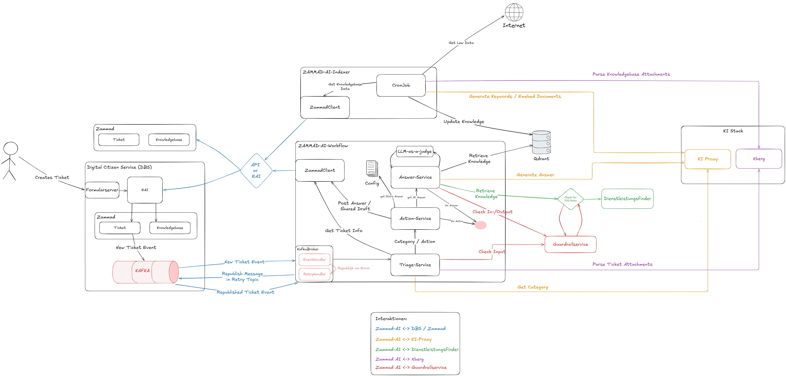

# Zammad-AI

[![Made with love by it@M][made-with-love-shield]][itm-opensource]

Zammad-AI is a GenAI-powered integration layer for Zammad. The repository contains three Python services:

- `zammad-ai-workflow`: the backend service for ticket triage, answer generation, Kafka processing, and the optional embedded frontend.
- `zammad-ai-index`: the indexing job that synchronizes Zammad knowledge base content into Qdrant.
- `slm-guardrails`: the content-safety service used by the workflow for prompt and response checks.

The services are separated from core Zammad so prompts, retrieval, automation rules, and integrations can evolve independently.

## Why a separate zammad-ai component

Zammad provides native [AI features](https://zammad.com/en/product/artificial-intelligence) (for example AI Agents, AI Ticket Summary, and AI Writing Assistant) with flexible operating models like managed AI, bring-your-own-model, or self-hosted LLMs. This repository addresses a different goal: a fully controllable integration layer for project-specific automation and knowledge retrieval workflows.

We keep this component separate from Zammad core to:

- Ship GenAI workflow changes independently from Zammad release cycles.
- Implement organization-specific triage, routing, and answer generation logic.
- Integrate custom retrieval pipelines (Qdrant indexing and domain prompts) beyond built-in defaults.
- Run event-driven processing via Kafka for high-volume and asynchronous support operations.
- Add project-specific observability, tracing, and compliance controls without patching Zammad itself.

### What is different from Zammad built-in AI components

- Product scope: Zammad built-in AI focuses on generic in-product assistance. `zammad-ai` focuses on backend orchestration, custom business rules, and external integrations.
- Extensibility: Zammad built-in AI is feature-configurable. `zammad-ai` is code-first and designed for custom prompts, adapters, and processing pipelines.
- Data flow: Zammad built-in AI is primarily embedded in UI workflows. `zammad-ai` adds event-driven ingest/filter/process/output flows and explicit indexing jobs.
- Operations: Zammad built-in AI is managed as part of Zammad. `zammad-ai` can be deployed, scaled, monitored, and released as independent services.
- Integration boundary: Zammad built-in AI enhances agent UX directly in Zammad. `zammad-ai` acts as a composable AI middleware that can serve Zammad and surrounding systems.

## What the project does

- Consumes ticket events from Kafka and exposes REST endpoints for triage and answer generation.
- Uses Qdrant for knowledge base retrieval.
- Integrates with Langfuse for tracing and prompt management.
- Delegates prompt and response safety checks to `slm-guardrails`.
- Supports Zammad REST API and EAI-based integrations.
- Exposes Prometheus metrics and an optional Gradio frontend for local workflows.

## Repository layout

- [zammad-ai-workflow/](zammad-ai-workflow/) - backend service and API entry point.
- [zammad-ai-index/](zammad-ai-index/) - knowledge base indexing job.
- [slm-guardrails/](slm-guardrails/) - content safety guardrail service.
- [docs/](docs/) - architecture, configuration, and API documentation.
- [compose.yaml](compose.yaml) - local Kafka, Qdrant, Mailpit, Prometheus, Grafana, and UI stack.
- [observability/](observability/) - Prometheus and Grafana provisioning files.

## Architecture



For the Digital Citizen Service architecture, see the [DBS Architecture documentation](https://it-at-m.github.io/dbs/architecture.html#architecture).

## Requirements

- Python 3.14.4
- [uv](https://github.com/astral-sh/uv)
- Docker and Docker Compose

## Documentation

- [Project overview](docs/index.md)
- [Configuration Guide](docs/configuration.md)
- [API Reference](docs/api.md)
- [Component Overview](docs/components/index.md)
- [Architecture ADRs](docs/adr/index.md)
- [Release Workflow](docs/release-workflow.md)

## Local setup

1. Start the local infrastructure from the repository root:

```bash
docker compose up -d
```

Available local services:

- Kafka UI: http://localhost:8089
- Mailpit: http://localhost:8025
- Qdrant: http://localhost:6333
- Prometheus: http://localhost:9091
- Grafana: http://localhost:3000

2. Install dependencies for the backend service:

```bash
cd zammad-ai-workflow
uv sync
```

3. Copy the example configuration and adjust it for your environment:

```bash
cp config.example.yaml config.yaml
```

4. Start the backend service:

```bash
uv run python main.py
```

5. Optional: enable the embedded Gradio frontend by setting `frontend.enabled: true` in `zammad-ai-workflow/config.yaml`. In development mode, the backend exposes:

- Frontend: http://localhost:8080/
- OpenAPI docs: http://localhost:8080/api/docs

6. Install dependencies for the indexing job when you need to sync the knowledge base:

```bash
cd ../zammad-ai-index
uv sync
cp config.example.yaml config.yaml
uv run python main.py
```

## API endpoints

The backend exposes the following public routes:

- `GET /api/v1/health`
- `GET /api/v1/prompt_versions`
- `POST /api/v1/triage`
- `POST /api/v1/answer`

## Testing and quality

Run the test suite:

```bash
cd zammad-ai-workflow # or cd zammad-ai-index
uv run pytest
```

Lint and format the code:

```bash
cd zammad-ai-workflow # or cd zammad-ai-index
uv run ruff check .
uv run ruff format .
```

Type check the codebase:

```bash
cd zammad-ai-workflow # or cd zammad-ai-index
uv run ty check
```

## Configuration notes

- Configuration is loaded from CLI arguments, environment variables, `.env`, and `config.yaml` in that order.
- Environment variables use the `ZAMMAD_AI_` prefix.
- Secrets should stay in `.env`, not in `config.yaml`.
- The backend and indexing job each have their own `config.example.yaml` file. Defaults are defined in the source code under `zammad-ai-workflow/app/settings/`.

## Contributing

Contributions are what make the open source community such an amazing place to learn, inspire, and create. Any contributions you make are **greatly appreciated**.

See the full guidelines in [CONTRIBUTING.md](CONTRIBUTING.md).

If you have a suggestion that would make this better, please open an issue with the tag "enhancement", fork the repo and create a pull request. You can also simply open an issue with the tag "enhancement".
Don't forget to give the project a star! Thanks again!

1. Open an issue with the tag "enhancement"
2. Fork the Project
3. Create your Feature Branch (`git checkout -b feature/AmazingFeature`)
4. Commit your Changes (`git commit -m 'Add some AmazingFeature'`)
5. Push to the Branch (`git push origin feature/AmazingFeature`)
6. Open a Pull Request

More about this in the [CODE_OF_CONDUCT](CODE_OF_CONDUCT) file.

## License

Distributed under the MIT License. See [LICENSE](LICENSE) file for more information.

## Contact

it@M - opensource@muenchen.de

[made-with-love-shield]: https://img.shields.io/badge/made%20with%20%E2%9D%A4%20by-it%40M-yellow?style=for-the-badge
[itm-opensource]: https://opensource.muenchen.de/
