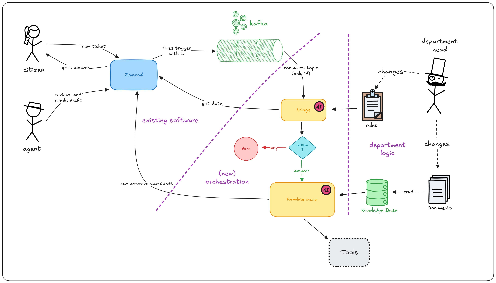

# ADR 01: System Architecture

| Status      | proposed |
| ----------- | -------- |
| Author      | @freinold |
| Voters      | @freinold, @lenabMUC, @pilitz |
| Drafted     | 2025-09-23 |
| Timeline    | tbd |

< optionally reference related ADRs >

## Context and Problem Statement

We need to decide on the system architecture for the Zammad-AI project.
The system architecture should be scalable, maintainable, and easy to understand.
It should embed well with the existing Zammad infrastructure.

The following criteria are relevant for the decision:

- Maintainability: The architecture should be easy to modify and extend.
- Integration: The architecture should integrate well with existing components (Zammad, Kafka).
- Transferability: The architecture should allow for easy transfer to other projects or use cases.

## Proposed Architecture

We propose a single service architecture for the Zammad-AI project.
This 'zammad-ai' service will be responsible for all AI-related functionalities and will communicate with the existing Zammad services via APIs.

The service shall be notified via a Kafka topic about new tickets and ticket updates.
It shall then gather ticket information via the API.
The ticket shall first be triaged to determine if AI assistance is needed.
If so, the service shall generate a response using a GenAI model and enhance it with relevant context from a knowledge base or external tools.
Finally, the generated response shall be sent back to Zammad via the API as a draft.

For other use cases like summarization, the service logic can be extended in the future.

## Decision Made

We have decided to implement a single service for the Zammad-AI project. This approach allows for better scalability, maintainability, and integration with existing components.
The use of a dedicated 'zammad-ai' service will enable us to focus on AI-related functionalities while leveraging the existing Zammad infrastructure.
