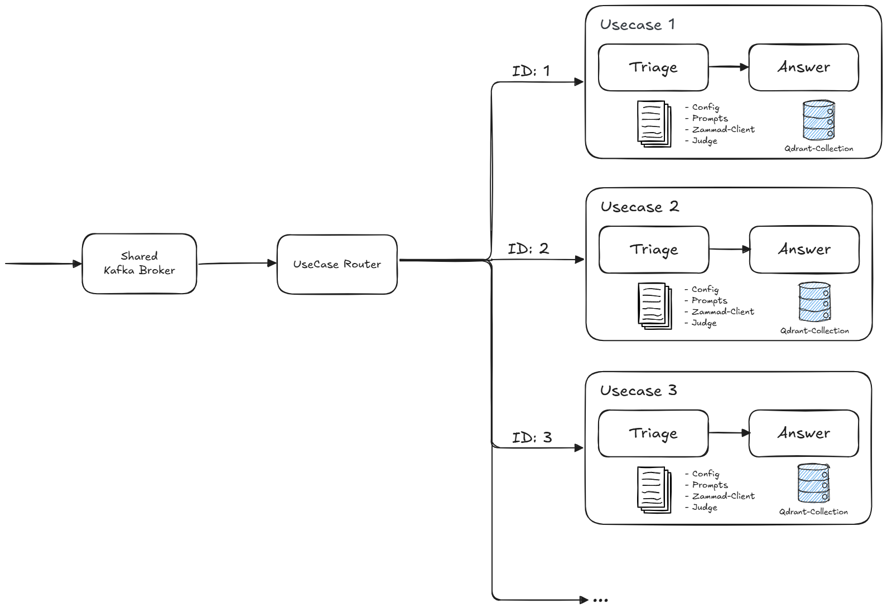

# ADR 06: Multi-Usecase System Architecture

| Status   | accepted                              |
| -------- | -------------------------------------- |
| Author   | @pilitz                                |
| Voters   | @freinold, @l0renor, @nharbig, @pilitz |
| Drafted  | 2026-10-08                             |
| Accepted | 2026-10-09                             |

Related: [ADR 01: System Architecture](01-system-architecture.md)

## Context and Problem Statement

The current Zammad-AI service is designed around one active use case at a time. It consumes events from Kafka, performs triage, and optionally generates an answer based on one shared configuration.

We now want to support multiple use cases within the same installation. All ticket events are still published to the same Kafka topic. The service therefore needs a way to inspect each incoming event, determine which use case it belongs to, and execute the correct triage and answer flow with usecase-specific configuration.

The following criteria are relevant for the decision:

- Maintainability: Adding a new use case should require minimal code changes.
- Operational simplicity: Kafka producers and topic layout should remain stable.
- Configurability: Each use case must be able to define its own categories, prompts, and tools.
- Safety: Routing must be deterministic and validated at startup.
- Reuse: The existing triage and answer logic should be reused as much as possible.
- Simplicity: Shared infrastructure should be preferred where a small amount of queuing or additional processing latency is acceptable.

## Decision: **One Kafka topic with an internal usecase router**.

The `zammad-ai` service will continue consuming from the existing Kafka topic. After validating an event, the service will resolve the target use case based on configured routing rules such as `request_type`, `action`, and optionally additional event metadata in the future. It will then dispatch processing to a dedicated usecase runtime that uses the same core logic as today, but with usecase-specific settings.

Kafka remains shared across all use cases. We use one Kafka broker/cluster and one Kafka user for the service rather than provisioning separate brokers or users per use case. A busy use case can therefore delay other use cases in the shared consumer flow. This is an accepted trade-off: short-term delays are preferable to the operational and configuration complexity of separate Kafka identities and infrastructure. If this assumption changes, usecase-specific consumers and credentials can be introduced later.

The service is logically composed of:

- one shared Kafka consumer
- one route resolver
- one service group per configured use case
- one fallback policy for unmatched events -> skip

Each usecase service group contains at least:

- one triage service
- one answer service
- one Zammad client

Other usecase-specific components, such as the judge, action service, GenAI client, tools, and Qdrant collection, are also resolved within that group. Shared components such as guardrails, Langfuse, the frontend, and feedback handling remain outside the groups and carry the usecase as metadata where required.

The existing triage and answer pipeline remains the foundation. The primary architectural change is that these services and the Zammad client must no longer be treated as one global singleton for the whole process. Instead, they must be instantiated per use case or resolved from a usecase registry.

### Architecture sketch

The service groups use shared guardrails, observability, frontend, and feedback infrastructure. A backlog in one group may temporarily increase processing latency for other groups; this is accepted for the initial implementation.

## Configuration Approach

To keep configuration easy to understand and extend, we will separate shared configuration from usecase-specific configuration.

### Shared root configuration

The root `config.yaml` remains responsible for cross-cutting settings such as:

- Kafka connectivity and topic names
- shared GenAI defaults
- Zammad connection settings
- logging, metrics, guardrails, and API settings
- router defaults such as fallback behavior and the usecase config directory

### Usecase-specific configuration files

Each use case gets its own configuration file under a dedicated directory, for example:

- `config/usecases/default.yaml`
- `config/usecases/tax.yaml`
- `config/usecases/permits.yaml`

Each usecase file should contain at least:

- `name` and `description`
- `match` rules for event routing
- `triage` configuration with categories, actions, and prompts
- `answer` configuration with prompts, tools, and retrieval settings
- optional overrides for selected settings where necessary

This keeps usecase onboarding simple: adding a new use case should mostly mean adding one file and the referenced prompts.

### Prompt organization

Prompts should also be structured per use case, for example:

- `prompts/usecases/default/...`
- `prompts/usecases/tax/...`
- `prompts/usecases/permits/...`

This prevents prompt coupling between domains and makes reviews easier.

## Consequences

- **Good**: Multiple business use cases can be handled without changing Kafka producers or adding new topics.
- **Good**: Existing triage and answer logic can be reused with limited architectural change.
- **Good**: Categories, prompts, retrieval settings, and tools can evolve independently per use case.
- **Good**: The configuration model scales better because each use case remains self-contained.
- **Good**: One Kafka broker/cluster and one service user keep deployment and access management simple.
- **Risk**: Ambiguous route definitions can cause non-deterministic behavior if not validated strictly.
- **Risk**: Current global singleton service patterns must be refactored to support multiple active runtimes.
- **Risk**: Observability and metrics must include a `usecase` dimension to keep operations understandable.
- **Risk**: A slow or busy use case can create a backlog and delay processing for other use cases.

## Implementation Notes

The implementation should follow these principles:

- validate all route definitions at startup
- fail fast on overlapping or ambiguous routing rules
- define an explicit policy for unmatched events: skip, fallback use case, or error
- keep Kafka consumption shared and central
- use one shared Kafka broker/cluster and service user initially; accept queueing before introducing usecase-specific Kafka identities
- keep business logic reusable and move variability into configuration
- prefer one configuration file per use case over one very large merged configuration
- instantiate or resolve the triage service, answer service, and Zammad client per use case
